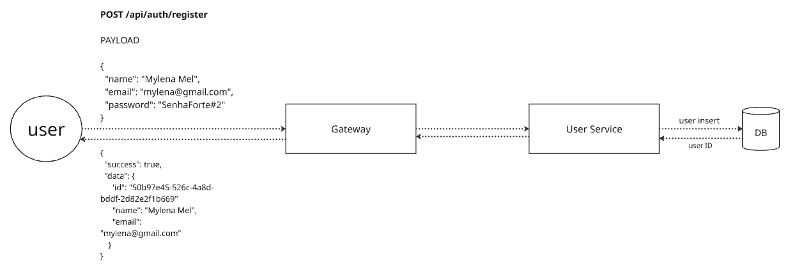
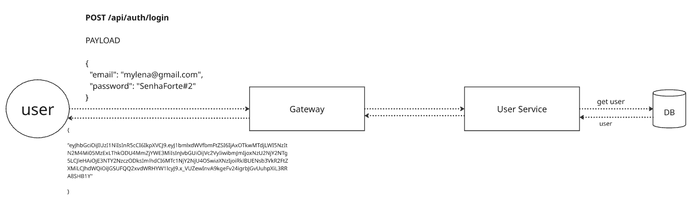

# FIAP Cloud Games Store - Users

Microsserviço responsável por lidar com o contexto de usuários (gerenciamento, autenticação e autorização) da aplicação.

## Tecnologias 

- .NET 8
- Entity Framework
- PostgreSQL
- Docker
- Bcrypt + JWT

## Arquitetura

- Clean Architecture
- Domain-Driven Design (DDD)
- Code-First + Migrations
- Result Pattern

## Funcionalidades

### Autenticação

1. **Registro**

Payload necessário para criar um usuário:

| **Campos** | **Validações** | 
|--------------|--------------|
| Email     | Formato de e-mail válido e não nulo      | 
| Password     | Ter 8 ou mais caracteres, incluindo, no mínimo, uma letra, um número e um caractere especial                                | 
| Name     | Nome não nulo e com mais de 3 caracteres  | 

O projeto utiliza **_result pattern_** então o retorno obtido contém os campos de: 

| **Campos** | **Tipo** | 
|--------------|--------------|
| Success     | Boolean     | 
| Data     | Genérico (usar DTO para retornos)                                | 
| Error     | Value Object Error  |
| Message     | String  |

Nesse caso o retorno vai conter, no **_data_**, os valores do ID gerado, nome e e-mail.

2. **Login**

Payload necessário para fazer login:

| **Campos** |
|--------------|
| Email     |
| Password     | 

A validação ocorre na API e caso o usuário exista e a senha esteja correta, é retornado apenas o **token JWT**.

Caso ocorra alguma exceção, será retornado o status code de **_Unauthorized_**.

### Gerenciamento de perfil

O usuário **autenticado** é capaz de gerenciar sua conta utilizando os endpoints:

Tipo | **Endpoint** | **Descrição** | 
|----|--------------|--------------|
| GET | api/user/user?id={GUID}     | Retornar informações do usuário     | 
| PUT | api/user/user?id={GUID}  + Body {"email": "", "name": "", "password": ""}    | Editar as informações do usuário                             | 
| DELETE | api/user/user?id={GUID}     | Remover usuário (hard delete)   | 

## Como executar o projeto localmente

### Requisitos

- Ter o Docker instalado

### Passos

1. Clonar o repositório na máquina
2. Navegar até a pasta onde o repositório foi clonado
3. Executar `docker-compose up -d` no terminal de comando 
4. Abrir `localhost:80/swagger` no navegador